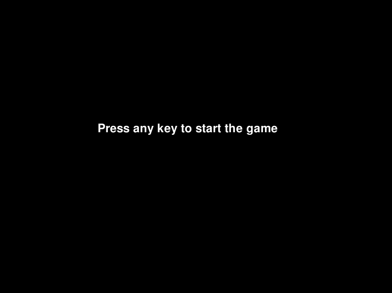
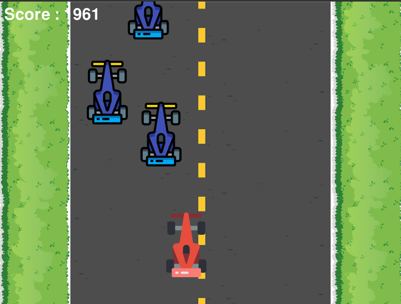
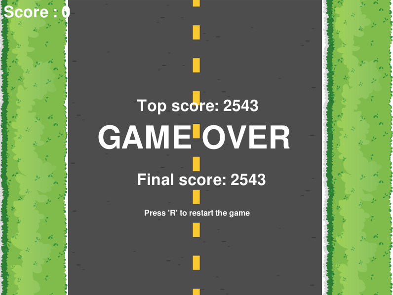

<!-- PROJECT LOGO -->
 

  <h3 align="center">PyOne Racing</h3>

  

    Car Racing Game
     
    <a href="https://github.com/halldorstefans/pyoneracing"><strong>Explore the docs »</strong></a>
     
     
    <a href="https://github.com/halldorstefans/pyoneracing/issues">Report Bug</a>
    ·
    <a href="https://github.com/halldorstefans/pyoneracing/issues">Request Feature</a>
  

<!-- TABLE OF CONTENTS -->
## Table of Contents

* [About the Project](#pyone-racing)
  * [Built With](#built-with)
* [License](#license)
* [Contact](#contact)
* [Acknowledgements](#acknowledgements)

<!-- ABOUT THE PROJECT -->
## PyOne Racing

This is a project I created for fun and to refresh my Python skills.

StartScreen:

Gameplay:

GameOver:

### Built With

* [Python 3.8](https://www.python.org/)
* [Pygame](https://www.pygame.org/)

<!-- LICENSE -->
## License

Distributed under the MIT License. See `LICENSE` for more information.

<!-- CONTACT -->
## Contact

Halldór Stefánsson - [@halldorstefans](https://twitter.com/halldorstefans)

Project Link: [PyOne Racing](https://github.com/halldorstefans/pyoneracing)

<!-- ACKNOWLEDGEMENTS -->
## Acknowledgements

* [freeCodeCamp.org - (YouTube link)](https://www.youtube.com/watch?v=FfWpgLFMI7w&list=WL&index=3&t=0s)
* [Attreya Bhatt](https://github.com/attreyabhatt/Space-Invaders-Pygame)
* [RealPython](https://realpython.com/pygame-a-primer/)
* [Nikita Golubev](https://www.flaticon.com/authors/nikita-golubev) - (Icon)
* [Smashicons](https://www.flaticon.com/authors/smashicons) - (Icon)
* [Alexander Blu](http://www.orangefreesounds.com/cinematic-electronic-track/) - (Sound)
* [NoiseForFun](https://www.noiseforfun.com/2013-sound-effects/bump/) - (Sound)